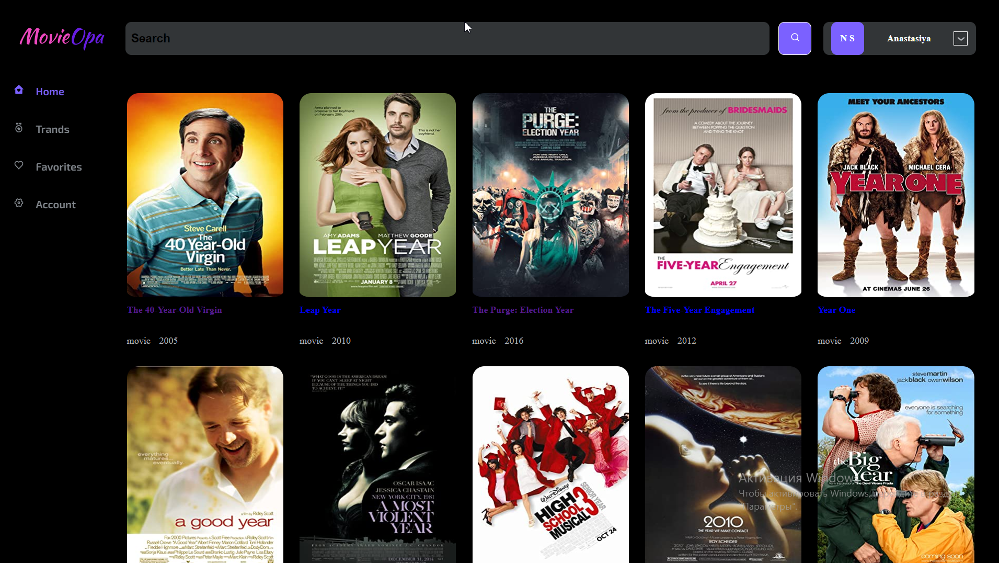
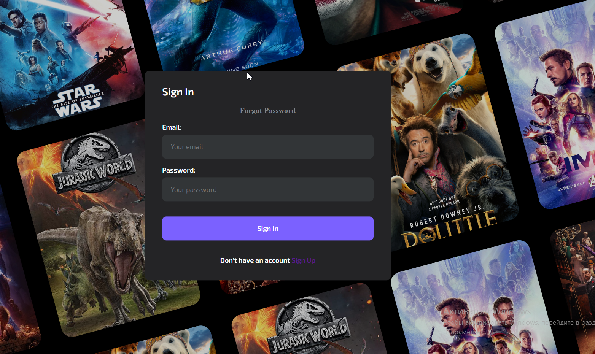
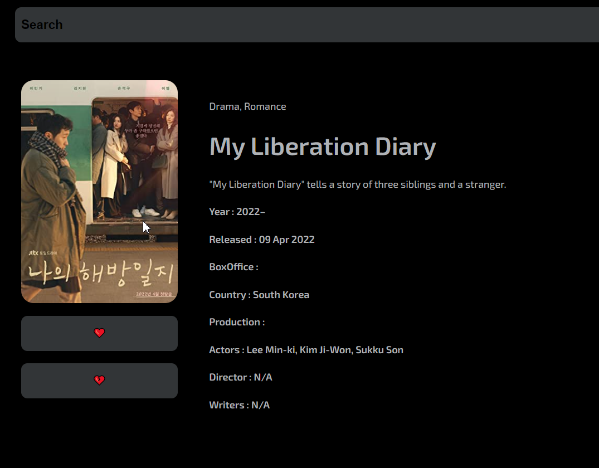

<div align="center">

   
  </a>

  <h3 align="center">MovieOpa React Project </h3>

  <p align="center">
    The app for searching movies!
    <br />
    <a href="https://github.com/Mazunok/movieopa-react-project"><strong>Explore the docs »</strong></a>
    <br />
</div>

____

<details>
  <summary>Table of Contents</summary>
  <ol>
    <li>
      <a href="#about-the-project">About The Project</a>
      <ul>
        <li><a href="#built-with">Built With</a></li>
      </ul>
    </li>
    <li>
      <a href="#getting-started">Getting Started</a>
    </li>
    <li><a href="#usage">Usage</a></li>
    <li><a href="#contact">Contact</a></li>
  </ol>
</details>

## About The Project



The are a lot of movie's search apps nowadays, and mine isn't the best one from technical side, but it's special because that's the project my way in programing starts from.

That's some points you would probably like my site:

1. Positive name if you understand my sence of humor
2. We all starts from something unperfect and this project is a good one to motivate you and don't let you to give up

This project wasn't easy for me but I starter to understand much more deeper how to work with API, learned some new libraries which makes the life of programmer much more easier and understood that I like writing code no matter how much stress it gives to me.

Probably it's not the final version of it, so in near future I'll give you an opportunity to see how my skills are growing.

<p align="right">(<a href="#top">back to top</a>)</p>

____

### Built With

The libraries I used to create my project:

* [Styled Components](https://styled-components.com/)
* [React.js](https://reactjs.org/)
* [Axios](https://www.npmjs.com/package/axios)
* [React Icons](https://react-icons.github.io/react-icons/)
* [Redux](https://react-redux.js.org/)
* [Typescript](https://www.typescriptlang.org/)
* [Framer Motion](https://www.framer.com/motion/)

<p align="right">(<a href="#top">back to top</a>)</p>

## Getting Started

This is an example how you can download my project

### Clone repository

   ```sh
   git clone https://github.com/Mazunok/movieopa-react-project.git
   ```

   Install NPM packages

   ```sh
   npm install
   ```

<p align="right">(<a href="#top">back to top</a>)</p>

___

## Usage

Using this app you can Sign In and Sign Up, Log Out, search movie and read details about every of them, you also can add or remove movies from favorites and some of the pages are private, so don't forget to sign Up.


</br>



</br>



<p align="right">(<a href="#top">back to top</a>)</p>

____

## Contact

Project Link: [https://github.com/Mazunok/movieopa-react-project](https://github.com/Mazunok/movieopa-react-project)

* [LinkediN](https://www.linkedin.com/in/anastasia-mazun-4681751bb/)
* [Email](mazun.1999@icloud.com)
* [Telegram](@mazunokN)

<p align="right">(<a href="#top">back to top</a>)</p>
